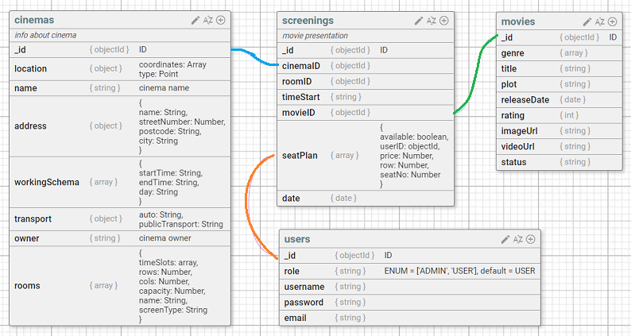
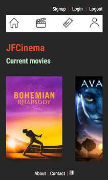
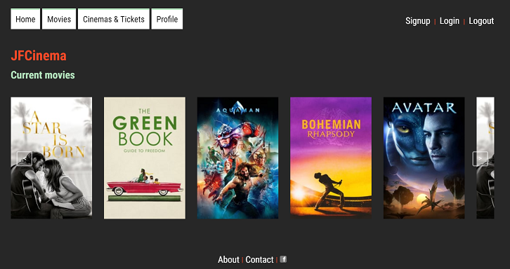
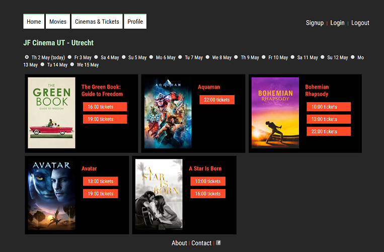
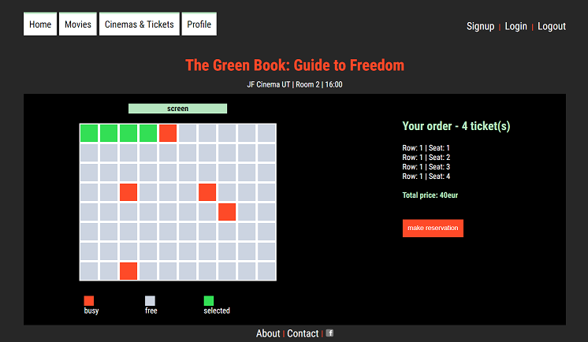

# JF - Cinema

## Instructions
.env file
- PORT=3000
- ENV=DEVELOPMENT
- KEY_MOVIE_DB=[API key for movie db prefill]
- GMAIL_PASS=[gmail pass]
- MONGODB_URI=[mongoDB connection]

Load seed files:
node db/user-seeds.js && node db/cinema-seeds.js && node db/movie-seeds.js && node db/screening-seeds.js
(takes a while due to hashing passwords)

### Functionalities
- Responsive
- Visual seat selection
- Admin route to add movies, cinemas, screenings
- Seed list scripts

### Preview
### database schema

#### mobile

#### desktop

### Next steps